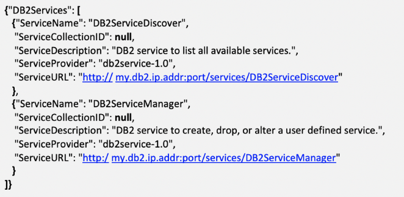
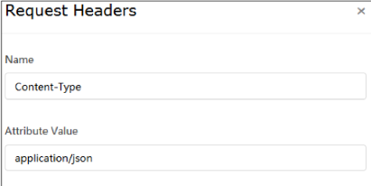
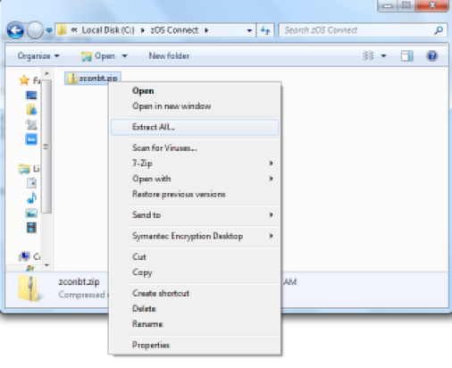
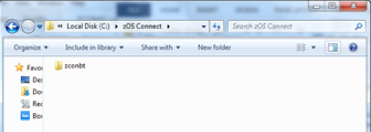
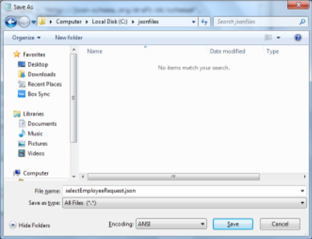
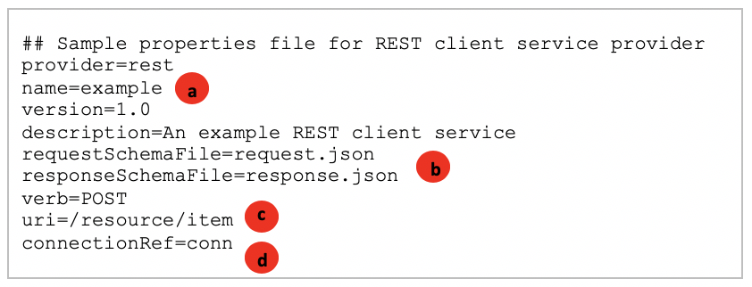

# 5. Expose DB2 data through z/OS Connect

- ## Creating a DB2 Service

  - To verify that REST Services have been installed on your system, you can enter this into the address for your browser: [http://my.db2.ip.addr:port/services/](http://my.db2.ip.addr:port/services/). There will be a result on the screen showing something like the box below: 
     
    _REST services for DB2 are defined either using a DB2 provided REST administrative service (DB2ServiceManager) or by using the DB2 BIND command using an update provided in DB2 PTF UI51748. There instructions walk through doing so using the RESTful administrative service._

  - Open the REST Client tool of your choice (for example, we will be usign a Firefoc browser plug-in).

  - Choose the Header with a **Content-Type** of **application/json**
    

  - Choose the POST method and use the url   http://my.db2.ip.addr:port/services/DB2ServiceManager

  - Modify the following stanza with the values for your service and paste it into the Body section (be sure to keep the requestType as "createService"):
    

  - Click **SEND**
    

  - If the command works, you will get an HTTP 201 response (which means that the call was successful and something was created).

  - In the Response, the new url for the service you created will be listed.
    

  - You have just created a service.

    _Note: If you want to verify that the service exists later, you can use that same url that was listed in the verification step (http://my.db2.ip.addr:port/services/) to show you the services that exist on your DB2 system._

  - ### Testing a DB2 Service

    If you want to see if this service call works, you can do so with the REST client.

    - Make sure to use the POST method and the Header with Content-Type of application/json
    - Copy the url for the service and paste it into the URL field (you can get this from the listing of services using the note above)
    - Include any parameters you need to pass for the service in the "Body" section.
    - Click SEND
      

  - ### Deleteing a DB2 Service

    If you made a mistake when you created your service or need to delete it for any reason, modify the stanza below and follow the first 5 parts of the Creating a DB2 Service step.
    

- ## Creating a .sar file

  - In order to turn your new service into an API using z/OS Connect, the service needs to have a Service Archive (.sar) file. The .sar file has the json request and response sechemas for the service as well as information about invoking it.    To create the .sar file for a DB2 service, the **z/OS Connect Build Toolkit** utility (**zconbt**) must be used. The utility can be installed on z/OS or on a Windows workstation. There instructions walk through using it on Windows.

  - ### Installing the Build Toolkit

    Locate the zconbt.zip file and unzip it into the directory of your choice. (That's all you need to do.) Make note of the directory where you unzipped it for future reference.
    
    

  - ### Creating the files needed for the Build Toolkit

    - There are three files that are used by the build toolkit to create the .sar file - a properties file, a json request file and a json response file.

      - The json request and json response files must be created manually. This is done by copying the json request and repsonse schema entries from the service description.

      - The properties file can be created by copying a sample file and editing it.

    - Open a browser and start the REST Client plugin.

    - Use the header with Content-type of application/json and choose the **GET** method.

    - Place the url for invoking the service in the URL field and click **SEND**. (Make sure the Body area of the form is blank.)
      

    - **Creatign the json files**

      - The json information for the request and response is in the response body for the invoked call. Select the entire area behind the words **"Request Schema"**: (including brackets) and **Copy** it.
        

      - On your workstation, open a blank document (such as notepad) and **paste** the text into it.
        

      - Choose/create a destination folder and **Save** the document as **\<serviceName>Request.json**
        

      - Return to the browser and select the area behind the words "**Response Schema":** (including brackets) **Copy** it.

      - On your workstation, open a blank document (such as notepad) and **paste** the text into it.

      - Choose a destination folder and **Save** the document as **\<serviceName>Response.json**
        _Note: you can either save these files in the zconbt/bin directory or include the path to the directory when creating your properties file._

    - **Now, it's time to create the properties file.**

      - _You can find a sample properties file in the \<path to zconbt>/samples/service folder. The correct one for DB2 rest service is named sample_restClient_sar.properties_
        

      - If you are doing this for the firs time, **right click** on the **sample_restClient_sar.properties** file and choose **Open With**. It is recommended the you use WordPad (easiest method to view/edit).

      - In the sample file, definitions of the fields are listed.
        

      - Edit the sample file to match the specifications for your new service. Guidance is included in the sample file. Some additional notes:

        - The service name shoould be the same as the name of the service from the "Creating a DB2 Service" part.
        - For consistency, the json request and response files should be named \<serviceName>\_request.json and \<serviceName>\_response.json
        - You can obtain portions of this value from your service URL that was called earlier during testing. Commonly, this would be /service/serviceName.
        - This value is your choice, but will also be used in the server.xml file.

      - Chhose **File** -> **Save As** and save the file with a new name. _Note the folder where you saved the file for use in the zconbt script._
        - _Note: Place this file in the same folder as the json files or include the path to the .json files in the properties file._

    - **Run the zconbt tool to generate the .sar file.**

      - Open a DOS command prompt in Adminstrator Mode.

      - Use the change directory command to go to directory \<path to zconbt>\bin

      - Run the command:  
        `zconbt --properties=<path to properties file>\<properties file name> --file=<path to sar file>\<sar file name>`
         _It is recommended to name your sar file \<serviceName>.sar_
        

    - If you get a response like "Successfully created service", then your .sar file is created. You are now ready to move to API creation.

- ## Creating the API
